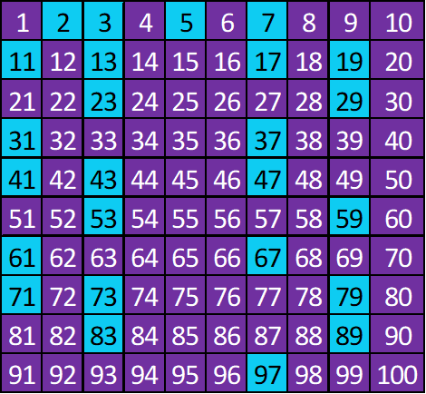

# Algoritmos para la Determinación de Números Primos

## Descripción

Este proyecto se centra en abordar la desafiante problemática de determinar los números primos en conjuntos de datos de gran magnitud. Para ello, se realizó una exhaustiva investigación que exploró diversas metodologías y algoritmos empleados en esta tarea.

Durante la fase de investigación, se llevó a cabo un análisis detallado de dos algoritmos fundamentales:

- La Criba de Atkin
- La Criba de Eratóstenes

Estos algoritmos son ampliamente reconocidos en el ámbito de las matemáticas y la informática por su eficiencia en la identificación de números primos dentro de un rango
dado.

Además de profundizar en el aspecto teórico de los algoritmos, se procedió a su implementación práctica en el lenguaje de programación C++, haciendo uso de la biblioteca
OpenMP. Esta elección estratégica permitió explorar el potencial de la programación multiproceso y paralela, con el objetivo de mejorar el rendimiento y agilizar el
proceso de búsqueda de números primos en sistemas que disponen de múltiples núcleos de procesamiento.

Durante la implementación, se abordaron diversas problemáticas relacionadas con el rendimiento y la posible sobrecarga del sistema al ejecutar los algoritmos en conjuntos
de datos extensos. Se realizaron evaluaciones comparativas entre la Criba de Atkin y la Criba de Eratóstenes para determinar cuál de ellos ofrecía un mejor desempeño en
diferentes escenarios.

A través del análisis de la complejidad temporal, expresada mediante la notación Big O, se obtuvieron conclusiones sólidas sobre la eficiencia relativa de los algoritmos,
permitiendo seleccionar la opción más adecuada para la búsqueda de números primos en el contexto de la problemática planteada.

Con esta investigación detallada y rigurosa, se espera proporcionar un enfoque sólido y fundamentado para abordar el desafío de encontrar números primos en grandes
conjuntos de datos, allanando el camino hacia futuros avances en el ámbito de la computación y las matemáticas.

A través del análisis de la complejidad temporal, expresada mediante la notación Big O, se obtuvieron conclusiones sólidas sobre la eficiencia relativa de los algoritmos,
permitiendo seleccionar la opción más adecuada para la búsqueda de números primos en el contexto de la problemática planteada.

Con esta investigación detallada y rigurosa, se espera proporcionar un enfoque sólido y fundamentado para abordar el desafío de encontrar números primos en grandes
conjuntos de datos, allanando el camino hacia futuros avances en el ámbito de la computación y las matemáticas.

## Algoritmos para determinar números primos

### Criba de Eratóstenes

La Criba de Eratóstenes es un antiguo algoritmo que permite encontrar todos los números primos en un rango determinado de valores. Fue desarrollado por el matemático griego
Eratóstenes de Cirene alrededor del siglo III a.C. Este algoritmo es eficiente para encontrar números primos hasta un límite predefinido y se basa en el principio de eliminar
los múltiplos de cada número primo encontrado.

#### Metodología

El algoritmo de la Criba de Eratóstenes sigue los siguientes pasos:

1. Crear una lista de números desde 2 hasta el valor máximo deseado.
2. Inicializar una variable llamada "p" en 2, que será el primer número primo.
3. Iterar sobre la lista de números y, para cada número, realizar lo siguiente:
4. Si el número actual no ha sido marcado como múltiplo de otro número primo previamente encontrado, se considera como un número primo válido.
5. Marcar todos los múltiplos del número actual como compuestos (no primos). Esto se logra eliminando los múltiplos del número actual de la lista.
6. Avanzar al siguiente número no marcado en la lista y repetir el paso anterior.

#### Ejemplo

Supongamos que queremos encontrar todos los números primos hasta el valor máximo de 100 utilizando la Criba de Eratóstenes. Los pasos serían los siguientes:

1. Primero, creamos una lista de números del 2 al 100, ya que sabemos que 2 es el número primo más pequeño y queremos encontrar todos los números primos hasta 100.
2. Comenzamos con el primer número de la lista, que es 2. Sabemos que 2 es primo, así que lo marcamos como tal y eliminamos todos sus múltiplos de la lista. En este caso,
   eliminamos los números 4, 6, 8, 10, 12, ..., hasta 100, que son múltiplos de 2.
3. Pasamos al siguiente número no marcado en la lista, que es 3. Lo marcamos como primo y eliminamos todos sus múltiplos de la lista. En este caso, eliminamos los números
   6, 9, 12, 15, ..., hasta 99, que son múltiplos de 3.
4. Continuamos este proceso para todos los números no marcados en la lista. Para cada número no marcado, lo marcamos como primo y eliminamos todos sus múltiplos de la lista.
5. Repetimos los pasos 3 y 4 hasta que hayamos recorrido todos los números no marcados en la lista.

Al finalizar el proceso, los números que queden en la lista serán los números primos encontrados.
En este caso particular, los números primos encontrados hasta 100 son: 2, 3, 5, 7, 11, 13, 17, 19, 23, 29, 31, 37, 41, 43, 47, 53, 59, 61, 67, 71, 73, 79, 83, 89 y 97.

Sí se desea indagar mas sobre el tema puede optar por revisar [sieve of eratosthenes](https://cp-algorithms.com/algebra/sieve-of-eratosthenes.html).
