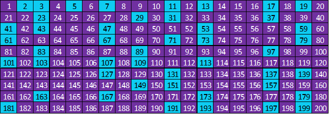
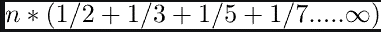
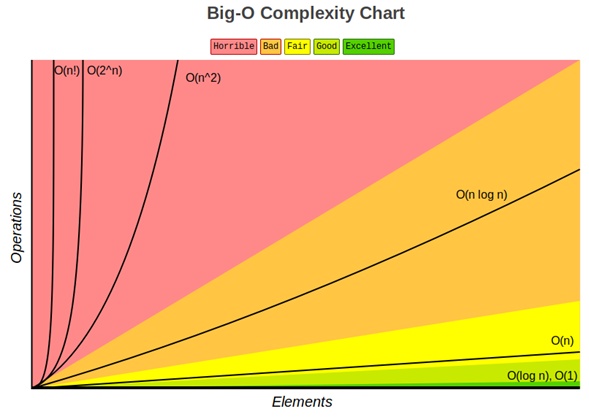
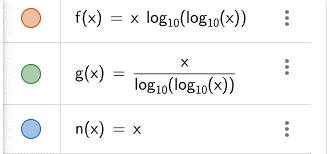
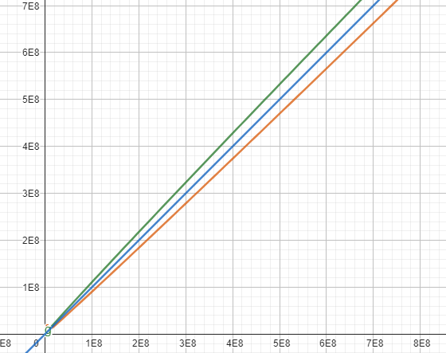
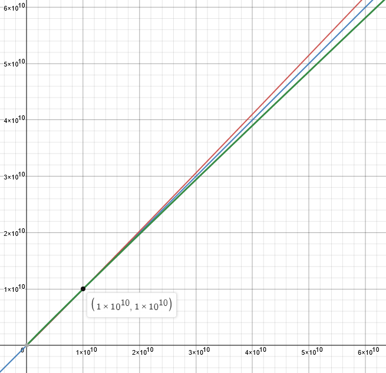
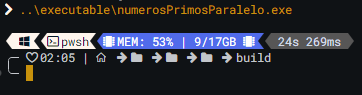
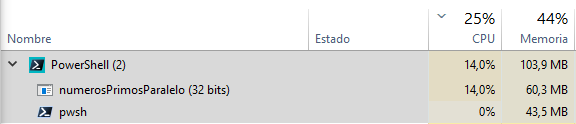
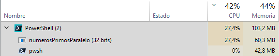

# Algoritmos para la Determinación de Números Primos

## Descripción

Este proyecto se centra en abordar la problemática de determinar los números primos en conjuntos de datos de gran magnitud. Para ello, se realizó una investigación que 
exploró diversas metodologías y algoritmos empleados en esta tarea.

Durante la fase de investigación, se llevó a cabo un análisis detallado de dos algoritmos fundamentales:

- La Criba de Atkin
- La Criba de Eratóstenes

Estos algoritmos son ampliamente reconocidos en el ámbito de las matemáticas y la informática por su eficiencia en la identificación de números primos dentro de un rango
dado.

Además de profundizar en el aspecto teórico de los algoritmos, se procedió a su implementación práctica en el lenguaje de programación C++, haciendo uso de la biblioteca
OpenMP. Esta elección permitió explorar el potencial de la programación paralela, con el objetivo de mejorar el rendimiento y agilizar el proceso de búsqueda de números
primos en sistemas que disponen de múltiples núcleos de procesamiento.

A través del análisis de la complejidad temporal, expresada mediante la notación Big O, se obtuvieron conclusiones sólidas sobre la eficiencia relativa de los algoritmos,
permitiendo seleccionar la opción más adecuada para la búsqueda de números primos en el contexto de la problemática planteada. Con esta investigación, se espera 
proporcionar un enfoque sólido y fundamentado para abordar el desafío de encontrar números primos en grandes conjuntos de datos.

## Algoritmos para determinar números primos

### Criba de Eratóstenes

La Criba de Eratóstenes es un antiguo algoritmo que permite encontrar todos los números primos en un rango determinado de valores. Fue desarrollado por el matemático griego
Eratóstenes de Cirene alrededor del siglo III a.C. Este algoritmo es eficiente para encontrar números primos hasta un límite predefinido y se basa en el principio de eliminar
los múltiplos de cada número primo encontrado.

#### Metodología

El algoritmo de la Criba de Eratóstenes sigue los siguientes pasos:

1. Crear una lista de números desde 2 hasta el valor máximo deseado.
2. Inicializar una variable llamada "p" en 2, que será el primer número primo.
3. Iterar sobre la lista de números y, para cada número, realizar lo siguiente:
4. Si el número actual no ha sido marcado como múltiplo de otro número primo previamente encontrado, se considera como un número primo válido.
5. Marcar todos los múltiplos del número actual como compuestos (no primos). Esto se logra eliminando los múltiplos del número actual de la lista.
6. Avanzar al siguiente número no marcado en la lista y repetir el paso anterior.

#### Ejemplo

Supongamos que queremos encontrar todos los números primos hasta el valor máximo de 100 utilizando la Criba de Eratóstenes. Los pasos serían los siguientes:

1. Primero, creamos una lista de números del 2 al 100, ya que sabemos que 2 es el número primo más pequeño y queremos encontrar todos los números primos hasta 100.
2. Comenzamos con el primer número de la lista, que es 2. Sabemos que 2 es primo, así que lo marcamos como tal y eliminamos todos sus múltiplos de la lista. En este caso,
   eliminamos los números 4, 6, 8, 10, 12, ..., hasta 100, que son múltiplos de 2.
3. Pasamos al siguiente número no marcado en la lista, que es 3. Lo marcamos como primo y eliminamos todos sus múltiplos de la lista. En este caso, eliminamos los números
   6, 9, 12, 15, ..., hasta 99, que son múltiplos de 3.
4. Continuamos este proceso para todos los números no marcados en la lista. Para cada número no marcado, lo marcamos como primo y eliminamos todos sus múltiplos de la lista.
5. Repetimos los pasos 3 y 4 hasta que hayamos recorrido todos los números no marcados en la lista.

Al finalizar el proceso, los números que queden en la lista serán los números primos encontrados.
En este caso particular, los números primos encontrados hasta 100 son: 2, 3, 5, 7, 11, 13, 17, 19, 23, 29, 31, 37, 41, 43, 47, 53, 59, 61, 67, 71, 73, 79, 83, 89 y 97.


Sí se desea indagar mas sobre el tema puede optar por revisar [sieve of eratosthenes](https://cp-algorithms.com/algebra/sieve-of-eratosthenes.html).

### Criba de Atkin

La [Criba de Atkin](https://iq.opengenus.org/sieve-of-atkin/), propuesta por A. O. L. Atkin y Daniel J. Bernstein en 2004, es un algoritmo avanzado diseñado para encontrar números primos hasta un límite dado de manera 
más eficiente que la Criba de Eratóstenes convencional. Esta técnica se basa en el [teorema de los residuos cuadráticos](http://enciclopedia.us.es/index.php/Resto_cuadr%C3%A1tico) y emplea operaciones matemáticas para determinar qué 
números son primos y cuáles son compuestos.

A diferencia de la Criba de Eratóstenes, que itera sobre todos los números y sus múltiplos, la Criba de Atkin se enfoca en encontrar patrones específicos relacionados con los 
residuos cuadráticos. Se aplican tres pruebas de residuos cuadráticos: 4x^2 + y^2, 3x^2 + y^2 y 3x^2 - y^2. Estas pruebas se utilizan para marcar los números como primos o 
compuestos, basándose en la congruencia de los valores resultantes con ciertos módulos.

#### Metodología

La implementación de la Criba de Atkin se puede resumir en los siguientes pasos:

1. Se crea un arreglo de tamaño n, donde n es el límite superior hasta el cual se desean encontrar los números primos. Inicialmente, todos los elementos del arreglo se marcan
como compuestos.
3. Se definen las tres pruebas de residuos cuadráticos: 4x^2 + y^2, 3x^2 + y^2 y 3x^2 - y^2. Estas pruebas se utilizan para determinar si un número es primo o compuesto.
4. Se itera sobre los valores de x e y en un rango adecuado que cumpla con la ecuación x^2 + y^2 ≤ n.
5. Para cada combinación de x e y, se calculan los valores de las pruebas de residuos cuadráticos.
6. Si los valores resultantes cumplen con ciertas condiciones, se marca el número correspondiente en el arreglo como primo.

#### Ejemplo

Suponiendo que se tienen que encontrar los numeros primos con N = 200 utilizando la Criba de Atkin:

1. Creamos un arreglo de tamaño 201, que incluye los números desde 0 hasta 200. Inicialmente, todos los elementos se marcan como compuestos.
2. Definimos las tres pruebas de residuos cuadráticos: 4x^2 + y^2, 3x^2 + y^2 y 3x^2 - y^2.
3. Comenzamos a iterar sobre los valores de x e y que cumplen con la condición x^2 + y^2 ≤ 200.
   * Para x = 1, probamos con y = 1, 2, 3, ..., hasta el máximo valor que cumpla con la condición x^2 + y^2 ≤ 200.
      * Para cada combinación de x e y, calculamos los valores de las pruebas de residuos cuadráticos.
      * Si los valores resultantes cumplen con las condiciones requeridas, marcamos los números correspondientes en el arreglo como primos.
4. Continuamos iterando sobre los demás valores de x, realizando el mismo proceso para cada combinación de x e y que cumpla con la condición x^2 + y^2 ≤ 200.

Al finalizar el proceso de iteración, revisamos los elementos del arreglo. Los números marcados como primos son los números primos encontrados hasta el límite de 200. 
Adicionalmente se puede revisar la siguiente documentacion en donde se realizan discusiones respecto a este tema [geeksforgeeks]([https://cp-algorithms.com/algebra/sieve-of-eratosthenes.html](https://www.geeksforgeeks.org/sieve-of-atkin/)).



En este ejemplo, los números primos encontrados mediante la Criba de Atkin con n = 200 son: 2, 3, 5, 7, 11, 13, 17, 19, 23, 29, 31, 37, 41, 43, 47, 53, 59, 61, 67, 71, 73, 79, 
83, 89, 97, 101, 103, 107, 109, 113, 127, 131, 137, 139, 149, 151, 157, 163, 167, 173, 179, 181, 191, 193, 197 y 199.

## Implementación en C++ utilizando OpenMP

A continuación, se realizará la implementación en C++ utilizando OpenMP de los algoritmos revisados anteriormente. Para ello, antes de comenzar con la implementación, es esencial
verificar que se cumplan los requisitos mínimos. Asegúrate de tener en cuenta lo siguiente:

**Compilador compatible con OpenMP**: Se debe de tener instalado un compilador compatible con OpenMP en tu sistema. Algunas opciones populares son GCC (GNU Compiler Collection), 
Clang y Microsoft Visual C++. Si aún no tienes instalado un compilador, es necesario descargar e instalar uno antes de continuar.

Para confirmar esto puedes utilizar el siguiente comando en el terminal:

```bash
gcc --version
```

```bash
g++ --version
```

**Habilitar OpenMP**: Verifica que OpenMP esté habilitado en tu compilador. Dependiendo del compilador que estés utilizando, esto puede requerir configuraciones adicionales. 
Por ejemplo, en el caso de GCC y g++, puedes habilitar OpenMP agregando la opción de compilación -fopenmp al momento de compilar.

Para confirmar esto puedes utilizar el siguiente comando en el terminal:

```bash
gcc -fopenmp --version
```

```bash
g++ -fopenmp --version
```

En lo personal, recomiendo utilizar el MinGW minimalista de [sourceforge](https://sourceforge.net/projects/mingw/) en Windows, que proporciona las librerias estandar incluyendo la de openmp 
de una manera facil y eficaz.

Por otro lado, para distribuciones de Linux basados en Debian como Ubuntu:

Compilador:
```bash
sudo apt install mingw-w64
```

Libreria OpenMp (si es que no se incluye en la instalacion anterior).
```bash
sudo apt install libomp-dev
```

### Criba de Eratóstenes

```c++
std::vector<bool> cribaDeEratostenes(int limite) {
  // Crear un vector para almacenar si cada número es primo o no
  std::vector<bool> esPrimo(limite + 1, true); // Inicializar todos los números como primos

  // Calcular la raíz cuadrada del límite para determinar hasta qué número iterar
  int sqrtLimite = static_cast<int>(std::sqrt(limite));

  #pragma omp parallel
  {
    #pragma omp for
    // Iterar sobre los números desde 2 hasta la raíz cuadrada del límite
    for (int p = 2; p <= sqrtLimite; ++p) {
      #pragma omp critical
      {
        // Si el número actual es primo
        if (esPrimo[p]) {
          // Marcar como compuestos todos los múltiplos del número actual
          for (int i = p * p; i <= limite; i += p) {
            esPrimo[i] = false;
          }
        }
      }
    }
  }

  // Devolver el vector que indica si cada número es primo o no
  return esPrimo;
}
```

### Criba de Atkin

```c++
std::vector<bool> cribaAtkin(int limite) {
  std::vector<bool> esPrimo(limite + 1, false); // Inicializar todos los números como compuestos
  esPrimo[2] = esPrimo[3] = true; // Definir valores iniciales como primos

  // Pasos de la Criba de Atkin
  int raizLimite = static_cast<int>(std::sqrt(limite));

  #pragma omp parallel
  {
    #pragma omp for
    // Iterar sobre los valores de x e y
    for (int x = 1; x <= raizLimite; ++x) {
      for (int y = 1; y <= raizLimite; ++y) {
        int n = (4 * x * x) + (y * y);
        if (n <= limite) {
          // Verificar si el residuo cuadrático cumple con las condiciones para ser primo
          if (n % 12 == 1 || n % 12 == 5) {
            #pragma omp critical
            esPrimo[n] = !esPrimo[n];
          }
        }

        n = (3 * x * x) + (y * y);
        if (n <= limite) {
          // Verificar si el residuo cuadrático cumple con las condiciones para ser primo
          if (n % 12 == 7) {
            #pragma omp critical
            esPrimo[n] = !esPrimo[n];
          }
        }

        n = (3 * x * x) - (y * y);
        if (x > y && n <= limite) {
          // Verificar si el residuo cuadrático cumple con las condiciones para ser primo
          if (n % 12 == 11) {
            #pragma omp critical
            esPrimo[n] = !esPrimo[n];
          }
        }
      }
    }

    #pragma omp for nowait // Permitir que otros hilos continúen sin bloqueo
    // Verificar los números primos según el paso de la Criba de Atkin
    for (int n = 5; n <= raizLimite; ++n) {
      if (esPrimo[n]) {
        int x = n * n;
        for (int k = x; k <= limite; k += x) {
          #pragma omp critical
          esPrimo[k] = false;
        }
      }
    }
  }

  // Devolver el vector que indica si cada número es primo o no
  return esPrimo;
}
```

## Complejidad temporal Big O

La complejidad temporal Big O nos permite evaluar el desempeño de los algoritmos en relación con el tamaño del problema. En el caso de 
las cribas de Atkin y Eratóstenes, son algoritmos eficientes utilizados para encontrar números primos dentro de un rango determinado.

En este apartado, presentaremos información relevante sobre estas cribas, incluyendo los datos recopilados y los resultados obtenidos. 
Analizaremos la complejidad temporal de cada algoritmo, lo cual nos proporcionará una idea clara de su eficiencia y rendimiento. 

### Criba de Eratóstenes

La criba de Eratóstenes es ampliamente reconocida por su eficiencia en la búsqueda de números primos. Su complejidad temporal se estima 
como una progresión armónica de números primos. Lo que se puede apreciar en la siguiente imagen:



En consecuencia, a medida en que el tamaño del rango en el que se buscan los números primos aumenta, la complejidad de la criba de Eratóstenes 
se aproxima a O(n log(log(n))). Esto implica que el tiempo de ejecución del algoritmo crece de manera logarítmica en relación con el tamaño 
del rango.

### Criba de Atkin

La criba de Atkin, en su versión modificada, es otro algoritmo eficiente utilizado para encontrar números primos en un rango dado. A diferencia 
de la criba de Eratóstenes, se basa en el teorema de los residuos para determinar qué números son potencialmente primos.

En este enfoque, se utiliza una fórmula específica, como por ejemplo, 4x^2 + y^2, que genera una secuencia de números. Al evaluar esta fórmula 
para diferentes valores de "x" e "y", se determina si un número es candidato a ser primo o no.

La versión modificada de la criba de Atkin puede reducir el uso de memoria al realizar las mismas operaciones que la versión original. Esto se 
traduce en una complejidad temporal de O(n/log(log(n))), donde "n" es el límite superior del rango en el que se buscan los números primos.

Sin embargo, es importante tener en cuenta que la criba de Atkin puede generar una carga de CPU significativa, especialmente cuando se trabaja 
con rangos muy grandes. Esto se debe a que el algoritmo requiere evaluar la fórmula específica en cada número del rango, lo que implica realizar
múltiples cálculos matemáticos.

### Graficos y resultados encontrados

Tomando como referencia la siguiente imagen se realizaron comparaciones en los algoritmos para ver su comportamiento grafico.



Utilizando esto, implementamos las siguientes funciones tomando como referencia O(n). En este caso N(x).




En el contexto del gráfico mostrado, se puede observar el rendimiento de dos algoritmos de criba: la criba de Eratóstenes y la criba de Atkin. Los datos
representados abarcan un rango de 500 millones de elementos.

El análisis del gráfico revela que la criba de Eratóstenes presenta el comportamiento más eficiente en términos de complejidad temporal. Luego, la sigue la
complejidad O(n), lo que significa que el tiempo de ejecución crece linealmente con el tamaño del rango de números primos buscados.

Por otro lado, se observa que la criba de Atkin tiene una complejidad O(N/log(log(n))), lo que implica que su tiempo de ejecución aumenta de manera 
logarítmica con respecto al tamaño del rango. Aunque es un algoritmo eficiente, se puede apreciar que su rendimiento es inferior al de la criba de 
Eratóstenes y O(n), especialmente cuando se trabaja con un rango de 500 millones de elementos.



En el nuevo gráfico presentado, se destaca un punto de inflexión en (1x10^10, 1x10^10), donde se observa un cambio en el rendimiento relativo de la Criba
de Atkin en comparación con la criba de Eratóstenes.

En ese punto, la criba de Atkin, con una complejidad O(N/log(log(n))), logra superar a la Criba de Eratóstenes en eficiencia. Este cambio en el rendimiento 
relativo sugiere que, a partir del punto de inflexión, la criba de Atkin se vuelve una opción más eficiente en términos de tiempo de ejecución para rangos 
más grandes.

Por otro lado, se realizaron pruebas de tiempo de ejecución con implementaciones paralelas de la Criba de Atkin y la Criba de Eratóstenes en un rango de 500
millones de números. Los resultados fueron sorprendentes, ya que la Criba de Atkin demostró ser más rápida que la Criba de Eratóstenes en este rango específico.

Esto indica que, en ciertas circunstancias y con una implementación paralela adecuada, la Criba de Atkin puede ofrecer un mejor rendimiento en términos de tiempo
de ejecución en comparación con la Criba de Eratóstenes. Sin embargo, es importante tener en cuenta que estos resultados pueden variar según el entorno de 
ejecución, el hardware utilizado y otros factores específicos de la implementación.

Eratostenes:



Atkin:


Durante las pruebas realizadas, se consideró únicamente la ejecución de los algoritmos sin incluir impresiones adicionales que pudieran afectar los 
resultados. Aunque los resultados obtenidos fueron similares con impresiones de numeros, con la distinción en que esta requeria un alto consumo de CPU.

Durante las pruebas, se evaluó el consumo de CPU de las implementaciones de la Criba de Atkin y la Criba de Eratóstenes. Los resultados confirmaron las 
expectativas, ya que la implementación de Atkin, al realizar más cálculos matemáticos, presentó un consumo ligeramente mayor de CPU en comparación con 
la implementación de Eratóstenes.

Esto indica que la Criba de Atkin, debido a su naturaleza algorítmica y los cálculos adicionales involucrados, puede requerir más recursos de CPU en 
comparación con la Criba de Eratóstenes.

Eratostenes:



Atkin:



En conclusión, durante las pruebas realizadas, se obtuvieron resultados interesantes en cuanto a la eficiencia de la Criba de Atkin y la Criba de Eratóstenes.

En términos de tiempo de ejecución, se observó que la implementación paralela de la Criba de Atkin superó a la Criba de Eratóstenes en un rango de 500 millones 
de datos, lo que indica que la Criba de Atkin fue más eficiente en términos de velocidad en esta situación específica.

Por otro lado, en cuanto al consumo de CPU, se encontró que la implementación de la Criba de Atkin mostró un consumo ligeramente mayor debido a los cálculos 
matemáticos adicionales que realiza en comparación con la Criba de Eratóstenes.

En consecuencia de los resultados obtenidos en las pruebas, se decidió seleccionar el algoritmo de la Criba de Atkin para la implementación del proyecto. 
La mayor eficiencia en tiempo de ejecución observada en un rango de 500 millones de datos, combinada con resultados satisfactorios en ambos casos, respaldó
la elección de la Criba de Atkin como la opción preferida. Además, se consideró que el consumo ligeramente mayor de CPU en la implementación de Atkin era 
aceptable en relación con los beneficios obtenidos en términos de velocidad.

## Compilación y ejecución

Respecto a la compilación y ejecución del programa se puede realizar de dos formas: 
* Por comando de compilación manual
* Mediante la utilización del archivo CMakeLists.txt proporcionado en el repositorio.

### Compilacion manual

Si se desea compilar el programa manualmente, se puede ejecutar el siguiente comando en la terminal, dependiendo del sistema operativo:

* Linux

Compilación:
```bash
g++ -fopenmp .\src\header\header.cpp .\src\header\header.h .\src\main.cpp -o main
```

Ejecución:
```bash
./main
```

* Windows

Compilación:
```bash
g++ -fopenmp .\src\header\header.cpp .\src\header\header.h .\src\main.cpp -o main.exe
```

Ejecución:
```bash
.\main.exe
```

Cabe destacar que el nombre del ejecutable "main" es opcional y queda a criterio de cada uno.

### Compilación mediante CMake

En el repositorio se incluye un archivo CMakeLists.txt que facilita el proceso de compilación. Para utilizarlo, se pueden seguir los siguientes pasos:

* Linux o Windows (con GitBash)
1. En la terminal, crea un directorio llamado build (si no existe) en el directorio raíz del proyecto

```bash
mkdir build
```

2. Acceder al directorio build recién creado

```bash
cd build
```

3. Ejecutar el comando "cmake .." para generar los archivos de compilación correspondientes

```bash
cmake ..
```

4. Ejecutar el comando en Linux "make" o "mingw32-make" en Windows para compilar el proyecto. Esto creara un directorio "executable/" fuera de la carpeta "build/"

* Linux
  
```bash
make
```

* Windows
  
```bash
mingw32-make
```

5. Por ultimo, ejecutar el ejecutable creado en el directorio "executable/" que se creo automaticamente

* Linux

```bash
../executable/numerosPrimosParalelo
```

* Windows

```bash
..\executable\numerosPrimosParalelo.exe
```
